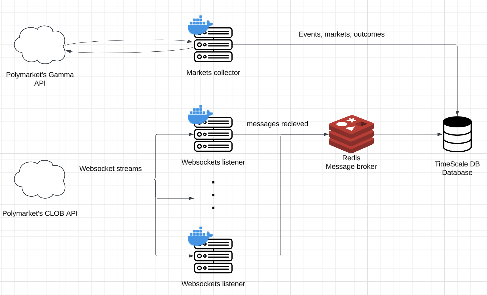

# Polymarket data collection

## Goal

Collect data from Polymarket, in a *raw* manner.

## Architecture overview

### Part 1: Events/markets/outcomes collections

 Polymarket has:
 - **Events**:
    - *e.g.* "How many rockets will SpaceX bring to space in 2025?"
 - **Markets**:
    - *e.g.* "0 rockets"
    - *e.g.* "1 rocket"
    - *e.g.* "2 rockets"
    - etc...
- **Outcomes**: Allways yes or no
    - *e.g.* "Yes"
    - *e.g.* "No"

Each of the outcomes has it's own orderbook. This is what the websocket streams.

The **markets collector** (top) is responsible for collecting this form the Polymarket Gamma API. It pushes Events, Markets and Outcomes to the database.

### Strep 2: Websocket subscriptions

The **websocket collector** is responsible for:
- Querying the database for outcomes to listen to (not represented in the image)
- Subscribing to the websocket streams for the outcomes
- Catching the messages, and sending them to the **message processor**

*n.b.*: for now, there's only one websocket listener, but the target vision is to have multiples ones live and die, because they'll likely be banned, or can't listenn to all of the websockets at once.

## Part 3: Message broker

This component is responsible:
- Receiving the messages sent by the websocket listeners
- Put them in a nice, centralised, queue
- Push them inside of the database